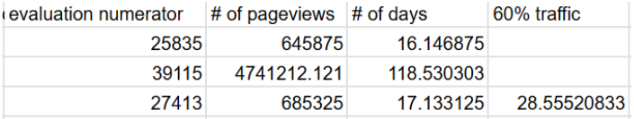

[Final Project Instructions](https://docs.google.com/document/u/1/d/1aCquhIqsUApgsxQ8-SQBAigFDcfWVVohLEXcV6jWbdI/pub) 
# Experiment Overview: Free Trial Screener

Udacity aimed to improve the student experience and optimize coach support by setting clearer expectations for students enrolling in the free trial. The goal was to reduce frustration among students who left the free trial due to insufficient time commitment, without significantly reducing the number of students who continued past the free trial and completed the course.

####

# Experiment Design

1. **Control Group**:
   * Students clicking "Start free trial" were taken directly to the checkout process (credit card entry) and enrolled in the 14-day free trial.
2. **Treatment Group**:
   * Students clicking "Start free trial" were asked how much time they could devote to the course weekly.
     + If they indicated **5 or more hours per week**, they proceeded to the checkout process as usual.
     + If they indicated **fewer than 5 hours per week**, a message appeared:
       - It stated that Udacity courses typically require more time for successful completion.
       - It suggested accessing the course materials for free instead.
     + Students could then choose to:
       - Continue enrolling in the free trial.
       - Access the course materials for free.

## Hypothesis

**Null Hypothesis**: The screener does not change the number of frustrated students who leave the free trial due to insufficient time or the number of students who continue past the free trial.

**Alternative Hypothesis**: The screener reduces the number of frustrated students who leave the free trial due to insufficient time without significantly reducing the number of students who continue past the free trial and complete the course.

## Metric Choice

**Invariant Metrics:**

Invariant metrics are those that do not change as a result of the experiment. They are used to ensure the experiment is set up correctly and that the control and treatment groups are comparable.

1. **Number of Cookies**:

* **Definition**: The number of unique cookies that view the course overview page (minimum detectable effect, dmin = 3000).
* **Rationale**: This metric is tracked before users encounter the screener feature, so it is unaffected by the experiment.

2. **Number of Clicks:**

* **Definition**: The number of unique cookies that click the “Start free trial” button (which occurs before the screener is shown).
* **Rationale**: Since the clicks happen before the screener appears, this metric remains unchanged by the experiment.

3. **Click-Through Probability (CTP):**

* **Definition:** The number of unique cookies that click the “Start free trial” button divided by the number of unique cookies that view the course overview page.
* **Rationale:** Both the clicks and views occur before the screener is introduced, so the CTP is unaffected by the experiment.

**Evaluation Metrics**:

Evaluation metrics are those that could change as a result of the experiment and are used to measure its impact.

1. **Gross Conversion:**

* **Definition**: The number of user-ids that complete checkout and enroll in the free trial divided by the number of unique cookies that click the “Start free trial” button.
* **Rationale**: The screener may discourage some users from completing checkout, so we expect gross conversion to decrease. This metric helps evaluate the screener’s impact on enrollment.

2. **Retention**:

* **Definition:** The number of user-ids that remain enrolled after the 14-day free trial divided by the number of user-ids that complete checkout.
* **Rationale:** Users who choose to enroll after seeing the screener are likely more committed, so weexpect retention to increase. This metric measures the screener’s effectiveness in filtering out less committed students.

3. **Net Conversion:**

* **Definition**: The number of user-ids that remain enrolled after the 14-day free trial divided by the number of unique cookies that click the “Start free trial” button.
* **Rationale**: The screener primarily affects the decision to complete checkout, not the likelihood of remaining enrolled afterward. Thus, net conversion is expected to remain relatively stable.

**Unused Metric:**

Number of User-IDs:

* **Definition:** The number of users who enroll in the free trial.
* **Rationale:** This metric is not used because it is not a proportional measure. It does not account for the baseline number of users who click the “Start free trial” button, making it less reliable for evaluating changes.

**Conditions to Launch the Experiment**:

Gross Conversion: Expected to decrease due to the screener discouraging some users from completing checkout.

Retention: Expected to increase as the screener filters out less committed students, leaving more determined users who are likely to remain enrolled.

Net Conversion: Expected to remain stable because the screener primarily affects the decision to enroll, not the likelihood of staying enrolled after the free trial.

## Measuring Standard Deviation

1. **Standard deviations of evaluation metrics**

Given a sample size of 5000 cookies visiting the overview pages and the conversion rate shown in the [table](https://docs.google.com/spreadsheets/d/1MYNUtC47Pg8hdoCjOXaHqF-thheGpUshrFA21BAJnNc/edit?gid=0#gid=0), we calculate the standard deviation for a binomial distribution.

SD = sqrt(p\*(1-p)/n)

2. **Analytical estimate vs empirical variability**

The empirical variability is the observed variability in the metric from actual experiment data. If the unit of diversion (how users are assigned to groups) matches the unit of analysis (how the metric is calculated), the analytical and empirical variability will be similar. If they differ, the analytical estimate may underestimate the empirical variability. The unit of diversion is cookie.

For gross conversion ( # of user-ids that complete checkout and enrollment / # of unique cookies that click “Start the free trial”) and net conversion (# of user-ids that remain enrolled past the 14-day free trial / # of cookies that click “Start free trial”), the unit of analysis is the # of cookies. Thus the analytical and empirical estimates are comparable.

For retention ( # of user-ids that remain enrolled past the 14-day free trial / # of user-ids that complete checkout and enrollment), the unit of analysis (user-ids) differs from the unit of diversion (cookies), so the analytical estimate will likely underestimate the empirical variability. An empirical estimate would be more accurate in this case.

## Sizing

### Number of Samples vs. Power

We do not need Bonferroni correction, which is used in multiple-comparison. However, we only have one test, and do not need Bonferroni correction.

We use the [online sample size calculator](https://www.evanmiller.org/ab-testing/sample-size.html).

Gross conversion:

Alpha = 0.05

Beta = 0.2

D\_min = 0.01

Probability of enrolling, given click: 0.20625

Sample size of click: 25,835

Pageview size: 25,835\*2/0.08 = 645,875

Retention:

Alpha = 0.05

Beta = 0.2

D\_min = 0.01

Probability of payment, given enroll: 0.53

Sample size of enroll: 39,115

Pageview size: 39,115\*2/(660/40000) = 4,741,212.121

Net conversion:

Alpha = 0.05

Beta = 0.2

D\_min = 0.0075

Probability of payment, given enroll: 0.1093125

Sample size of enroll: 27,413

Pageview size: 27,413 \* 2 /0.08=685,325

Since the page views calculated from the retention is the largest, we will choose it as the pageview required.

### Duration vs. Exposure

We first calculate how many days we need for each evaluation metrics if we divert all traffic to this experiment. The duration for gross conversion, retention and net conversion is 17, 119 and 18 days. Since the duration for retention is too long, which is not practical, we will give up this evaluation metric. Then we will use the other two evaluation metrics, which will take around 18 days. However, it is risky to divert all traffic as we can not do other tests and half of the users will be exposed to the experiment. We choose to use 0.6 fraction of traffic, and it will take 29 days to complete the experiment, which is reasonable.

We first calculate the number of days required for each evaluation metric if we divert all traffic to this experiment. The durations are as follows:

* Gross Conversion: 17 days
* Retention: 119 days
* Net Conversion: 18 days

Since the duration for retention is excessively long (119 days) and impractical, we will exclude this metric from the experiment. This leaves us with gross conversion and net conversion, which would take approximately 18 days to complete if all traffic is diverted.

However, diverting all traffic to this experiment poses risks:

* It prevents running other experiments simultaneously.
* Half of the users would be exposed to the experiment, which may not be ideal.

To mitigate these risks, we decide to use a 0.6 fraction of traffic for the experiment. This adjustment increases the duration to 29 days, which is still reasonable and allows for better traffic management and flexibility in running other experiments.

# Experiment Analysis

## Sanity Checks

**# of cookies:**

We expect the distribution of cookies in the control and experiment groups to be equal and thus is 0.5. We observe that the probability of cookies in the control group is 345543/(345543 + 344660) = 0.5006396669. The standard error of the control group is sqrt(p\_hat\*(1-p\_hat)/n = sqrt(0.5\*(1-0.5)/(345543+344600))

The margin of error (MOE) = z\*SE = 1.96 \* sqrt(0.5\*(1-0.5)/(345543+344600)) = 0.001179607851.

Confidence interval = p\_hat +- MOE = [0.4988203921, 0.5011796079].

The observed value 0.5006396669 falls within the confidence interval, so the sanity check passes.

**# of clicks:**

Expected value p = 0.5

Observed p\_ctrl = 0.5004673474

MOE = 1.96\*sqrt(0.5\*(1-0.5)/(28378 + 28325) = 0.004115504276

CI = [0.5 - 0.004115504276, 0.5 + 0.004115504276] = [0.4958844957, 0.5041155043]

The observed value 0.5004673474 falls within the confidence interval, so the sanity check passes.

**Click-through-probability on “Start free trial”:**

number of clicks: 28378 for control group, 28325 for experiment group.

number of page views: 345543 for control group, 344660 for experiment group.

P\_pooled = ( 28378 + 28325)/(345543 + 344660) = 0.0821540909

MOE = Z\*sqrt(p\_pooled \* ( 1 - p\_pooled)\*(1/n\_c + 1/n\_t)) = 1.96\*sqrt(0.0821540909\*(1-0.0821540909)\*(1/345543 + 1/344660) = 0.001295679199

Observed ctp: ctp\_ctl = 28378/345543 = 0.08212581357, ctp\_exp = 28325/344660 = 0.08218244067

Difference = ctp\_exp - ctp\_ctl = 0.00005662709159

CI = d -+ moe = [-0.001239052107, 0.00135230629]

The CI includes 0, thus the metric passes the sanity check.

## Result Analysis

### Effect Size Tests

Gross conversion:

P\_pooled = # of enrollment in both groups / # of clicks in both groups = 0.2086070674

SE = sqrt(p\_pooled\*(1-p\_pooled)\*(1/n\_ctl + 1/n\_exp) = 0.004371675385

MOE = Z\*SE = 0.008568483755

D = p\_exp - p\_ctl = 3423/17260 - 3785/17293 = -0.02055487458

CI = D \_+ MOE = [-0.02912335834, -0.01198639083]

As the CI does not include 0, it is statistically significant.

As the CI does not include D\_min (0.01), it is practically significant.

Net conversion:

P\_pooled = # of payment in both groups / # of clicks in both groups = (2033 + 1945) / (17293 + 17260) = 0.1151274853

SE = sqrt(p\_pooled\*(1-p\_pooled)\*(1/n\_ctl + 1/n\_exp) = 0.003434133513

MOE = Z\*SE = 0.006730901685

D = P\_exp - p\_ctl = 0.1126882966 - 0.1175620193 = -0.004873722675

CI = D -+MOE = [-0.01160462436, 0.001857179011]

As CI includes 0, it is not statistically significant. So it is also not practically significant.

### Sign Tests

We use an [online tool](https://www.graphpad.com/quickcalcs/binomial1/) to perform sign tests.

| Evaluation metric | + Sign | - Sign | Probability | P\_value (two-tail) |
| --- | --- | --- | --- | --- |
| Gross conversion | 4 | 19 | 0.5 | 0.0026 |
| Net conversion | 10 | 13 | 0.5 | 0.6776 |

The sign test shows that the p-value of the gross conversion is smaller than 0.05 and thus it is statistically significant, while the p-value of the net conversion is larger than 0.05 and thus it is not statistically significant.

### Summary

1. **Bonferroni Correction**:

We did not use the Bonferroni correction in this experiment. The Bonferroni correction is a method for addressing the issue of multiple comparisons, where several statistical tests are performed simultaneously. It adjusts the significance level to reduce the risk of Type I errors (false positives).

In our experiment, each statistical test (e.g., gross conversion, net conversion) was performed and evaluated independently. Since the tests are not part of a family of comparisons, the Bonferroni correction is unnecessary.

2. **Effect Size Hypothesis Tests and Sign Tests**:

The results of the effect size hypothesis tests and the sign tests are consistent with each other:

* Gross Conversion: Both tests show that the change in gross conversion is statistically significant. This indicates that the screener had a measurable impact on reducing the number of users who complete checkout and enroll in the free trial.
* Net Conversion: Both tests show that the change in net conversion is not statistically significant. This suggests that the screener did not significantly affect the number of users who remain enrolled past the 14-day free trial.

3. **Conclusion**:

The experiment successfully demonstrated that the screener reduces the number of users who enroll in the free trial (gross conversion) without significantly impacting the number of users who remain enrolled and continue with the course (net conversion). This aligns with the hypothesis that the screener sets clearer expectations for users, reducing frustration and improving the overall student experience.

## Recommendation

The analysis shows a statistically and practically significant decrease in gross conversion. This indicates that the screener effectively reduces the number of students who enroll in the free trial, likely by setting clearer expectations and preventing students who lack sufficient time from enrolling. This aligns with the goal of reducing frustration among students.

The net conversion is not statistically significant, meaning there is no significant difference in the proportion of students who make payments after clicking "Start free trial." From a revenue perspective, the screener does not appear to increase the number of students making payments. In fact, the probability of payment to click slightly decreases, which could result in fewer students making payments. This poses a risk to revenue.

Due to the impractical duration required to measure retention (119 days), we were unable to evaluate whether the screener impacts the number of students who remain enrolled after the free trial and complete the course. Without this information, we cannot assess whether the screener improves long-term student outcomes or coach efficiency.

While the screener successfully reduces frustration by decreasing gross conversion, it does not provide a clear benefit to revenue (net conversion) and may even slightly reduce payments. Additionally, the lack of data on retention leaves a critical gap in understanding the screener's impact on student success and coach workload.

Given these findings and uncertainties, we do not recommend launching the feature at this time. Further investigation or experimentation may be needed to address the risks and uncertainties, particularly regarding retention and revenue impact.

# Follow-Up Experiment

Given that Udacity aims to increase the students’ satisfaction and improve the coaches' capacity to support students who are likely to complete the course, we could experiment with other actions to reach such a goal.

In addition to time allocation to the course for successful completion, the difficulty of the course could be another important reason that impacts students on completing the course. Therefore, we could create a feature of Q&A where anyone in the group is encouraged to record the problems/errors they encounter during the course, so other students can refer to and help them proceed to the next stage. Different from a forum, this Q&A feature is a summary of common issues with correct solutions, so the students can find solutions easily and efficiently. In this way, it will reduce students’ frustration and liberate the coaches from too much workload. The experiment will be set up as follows.

**Experiment**: Add a Q&A report feature in the experiment group where anyone can add the bugs they encounter in the course with solutions.

**Null Hypothesis**: The number of students remaining enrolled past the free trial does not change with the Q&A feature.

**Alternative Hypothesis**: The number of students remaining enrolled past the free trial changes with the Q&A feature.

**Invariant metrics**

* The number of students who click and enroll in the “Start the free trial”. This takes place before the Q&A feature is experimented.

**Evaluation metrics**

* Retention: the number of students who remain enrolled past the free trial divided by the number of students who enrolled in the free trial
* Gross completion conversion: the number of students who complete the course divided by the number of students who enrolled in the free trial
* Net completion conversion: the number of students who complete the course divided by the number of students who remained enrolled past the free trial
* Workload: the number of support requests for coaches

The unit of diversion is user-id as the experiment is performed after students click the “Start the free trial”.

**Expected Outcomes**

* Positive: The Q&A feature improves retention, increases course completion rates, and reduces coach workload.
* Negative: The Q&A feature has no significant impact on retention or completion rates, or it increases coach workload if students rely too heavily on the feature.
